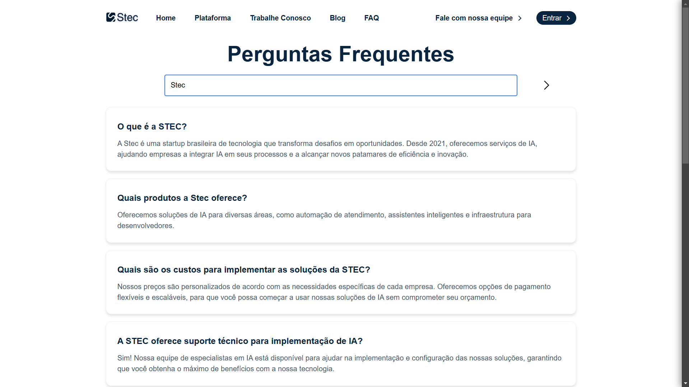
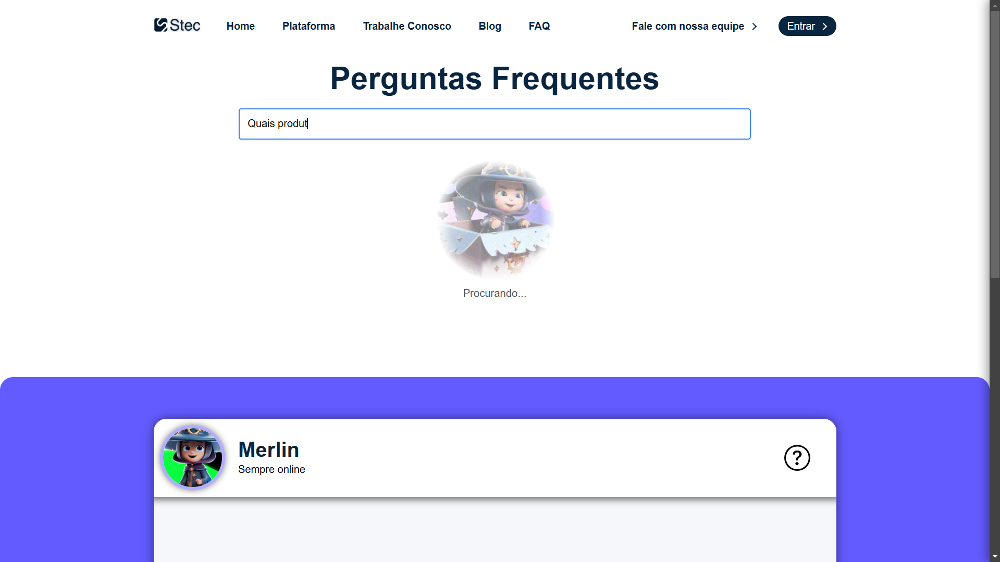
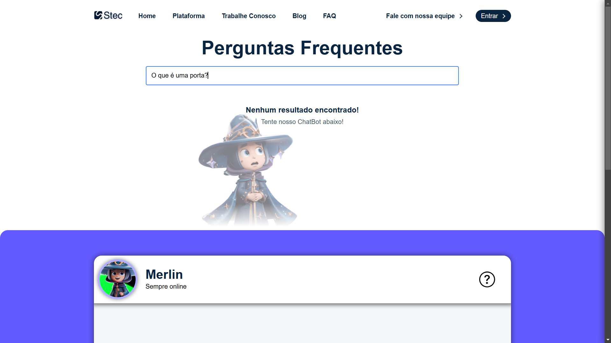
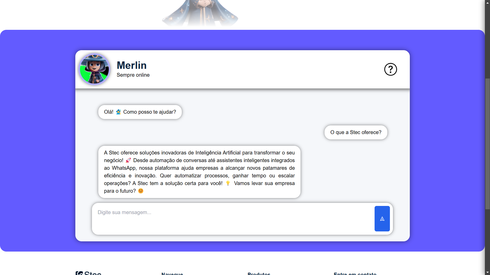
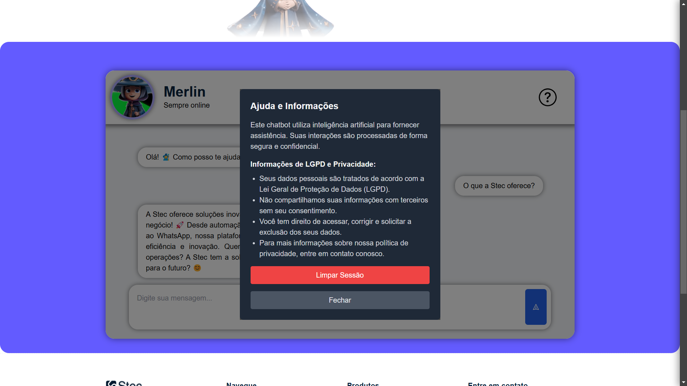
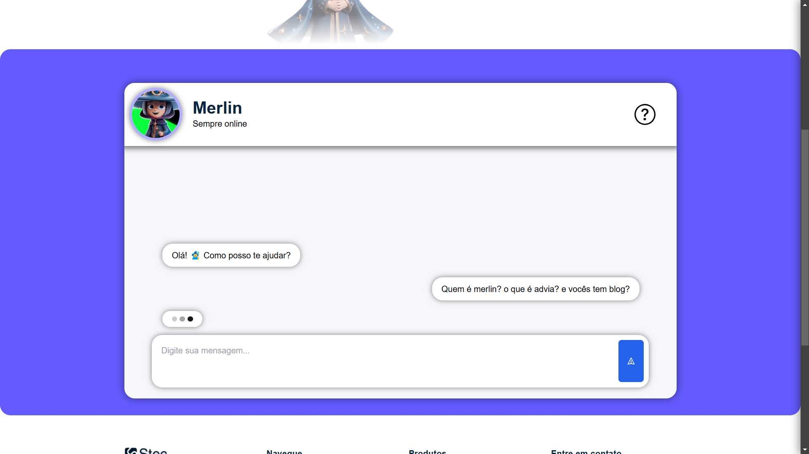
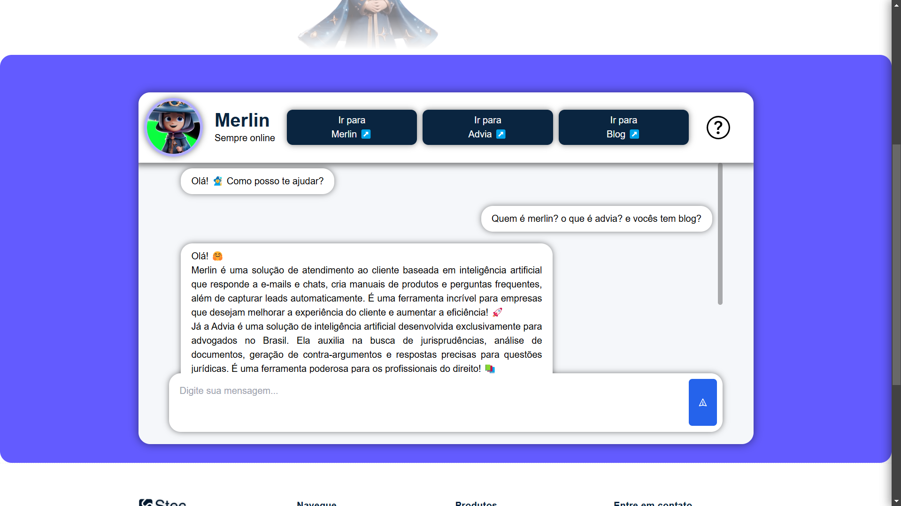

# 🌐 Web Application

## 📜 Descrição

Esta é uma aplicação web desenvolvida utilizando HTML, CSS e JavaScript puro, organizada em componentes modulares. A aplicação inclui um chatbot interativo 🤖 e uma seção de perguntas frequentes (FAQ). A ideia surgiu pela demanda da empresa [Stec](https://stec.cx) em sua página de [oportunidade de trabalho freelancer](https://stec.cx/jobs). Mais especificamente na demanda "Criar página de FAQ/Suporte com busca dinâmica". O projeto está configurado para ser executado em um contêiner Docker 🐳.

## 📂 Estrutura do Projeto

```
/
├── assets/          # Contém arquivos estáticos (imagens, gifs, svg, etc.)
├── components/      # Componentes padrões reutilizáveis da interface do usuário
│   ├── footer/      # Componente de rodapé da página
│   ├── navBar/      # Componente de barra de navegação
│   ├── sideBar/     # Componente de barra lateral
│   └── sideBarPlat/ # Componente da barra lateral da plataforma
├── core/            # Funcionalidades e utilitários centrais da aplicação
├── data/            # Dados de informação estáticos .json
├───image/           # ScreenShots da aplicação para o README.md
│   └───README/
└── sections/        # Seções principais da aplicação
    ├── chatBot/     # Seção dedicada ao chatbot
    │   └── Models/  # Classes de manipulação da seção e o chatbot
    └── FAQ/         # Seção de Perguntas Frequentes
        └── Models/  # Classes de manipulação do FAQ

```

## 🚀 Como Rodar a Aplicação

### ✅ Pré-requisitos

- Docker instalado na máquina.

### 🛠 Passos

1. Clone este repositório:
   ```sh
   git clone https://github.com/seu-repositorio.git
   ```
2. Acesse a pasta do projeto:
   ```sh
   cd nome-do-repositorio
   ```
3. Construa a imagem Docker:
   ```sh
   docker build -t nome-da-imagem .
   ```
4. Execute o contêiner:
   ```sh
   docker run -d -p 8080:80 nome-da-imagem
   ```
5. Acesse a aplicação no navegador em [`http://localhost:8080`](http://localhost:8080) 🌍.

## 🤖 Como o Chatbot foi Treinado

O chatbot presente no projeto funciona utilizando informações da própria STEC, no comportamento padrão (tipo system) foi dito para se comportar como atendente da STEC tentando convencer o usuário de utilizar os produtos dela, as repostas devem ser longas a menos que seja pedido pelo usuário, além de não reponder perguntas fora do objetivo do bot e caso aconteça, tentar linkar a resposta à pergunta do usuário com o objetivo de convencer ele. Já as informações de consulta (tipo data) foi colocado perguntas e respostas geradas pelo GPT-4o a partir das informações das páginas específicas da STEC (Home, Merlin, Advia) e do blog também. 

## 📲 Como o front-end se comunica com a API

A comunicação é simples, existe uma classse chamada ChatBot que faz as chamadas de API padrão para o merlin. A entrada do usuário é o texto escrito no Chat da seção chatBot do front-end, e ao clicar no botão ao lado para enviar, o texto escrito é guardado e colocado no payload da requisição, durante esse tempo, não é possível digitar pois está sendo aguardado a resposta da API. Quando a resposta chega ela é processada para aceitar o markdown e é colocada dentro de um container de mensagem para aparecer no Chat do front-end.

📌 **Arquivos Relevantes:**

- `sections/chatBot/Models/ChatBot.js` – Lógica principal do chatbot.

## 🎨 Capturas de Tela
### FAQs ✍🏽





### ChatBot 🤖






## 🛠 Tecnologias Utilizadas

- HTML5
- CSS3
- JavaScript
- Docker

## 🎯 Roadmap Futuro

🔹 Adicionar dark mode 🌒 🔹 Melhorar a UI/UX 🎨 🔹 Integrar respostas mais personalizadas ✏️🔹 Melhorar a experiência de botões e ações do ChatBot 🔼 🔹 Carregar página em buffer antes de renderizar para o usuário ⌛ 🔹

📬 **Contato:** [hugomoraes013579@gmail.com](mailto\:hugomoraes013579@gmail.com)

